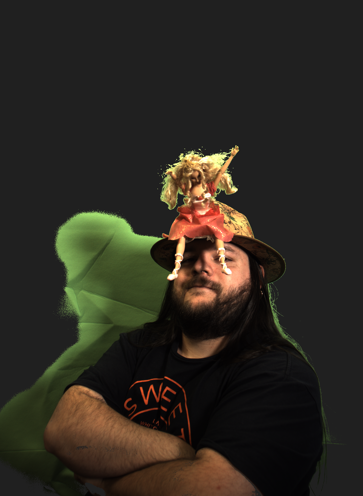

# README #

## How do I get set up?

## Prerequsites
* QT installed.
* Cmake installed.
* Git installed

## Install
* Clone the remote git repository, this should also give you the master branch.

  `git clone https://github.com/davidpshea/8itest.git`

* Switch to the project directory.

  `cd 8itest`

* If not already done, let cmake know where the QT cmake package configuration is by setting the
environment variable `CMAKE_PREFIX_PATH`
For instance, for my Mac, this would be

  `export CMAKE_PREFIX_PATH=/Users/davidshea/source/qt/5.15.0/clang_64`

* Initialise the build using cmake

  `cmake . -B build`

* Build the app, for example, this will build the release version.

  `cmake --build build --config release`

* You should then have an executable `8i` in the build directory. You should run this in the `8itest` directory (where the source files are) so the app knows where the background image is, as it looks for the folder `givenfiles`

  `./build/8i`

## Running

When the app runs, there's 5 buttons on the left, and a slider.
- `Load Image` Loads an image to be background removed.
- `Load Backdrop` Loads a blank backdrop that's the background without anything to remove.
- `Save Image` Saves the original image, debayered, and orientated as seen in the app as a PNG file.
- `Save Foreground` Saves the background removed image, orientated as seen in the app as a PNG file.
- `Rotate 90` Rotates the images 90 degrees clockwise on each click.
- The slider `threshold` controls how exact the match between background pixels has to be before it's considered background.

- You can resize the window and the images will resize with it.
- There's some sample output in `exampleoutput`
- The original images are held in `givenfiles`.

## Known Issues

- There's some resize oddness when the window gets too small to hold both images.
- Button layout could do with improving.

## Example Output

